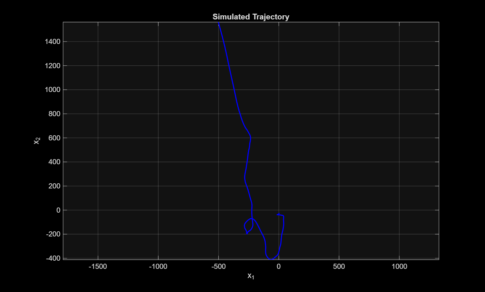
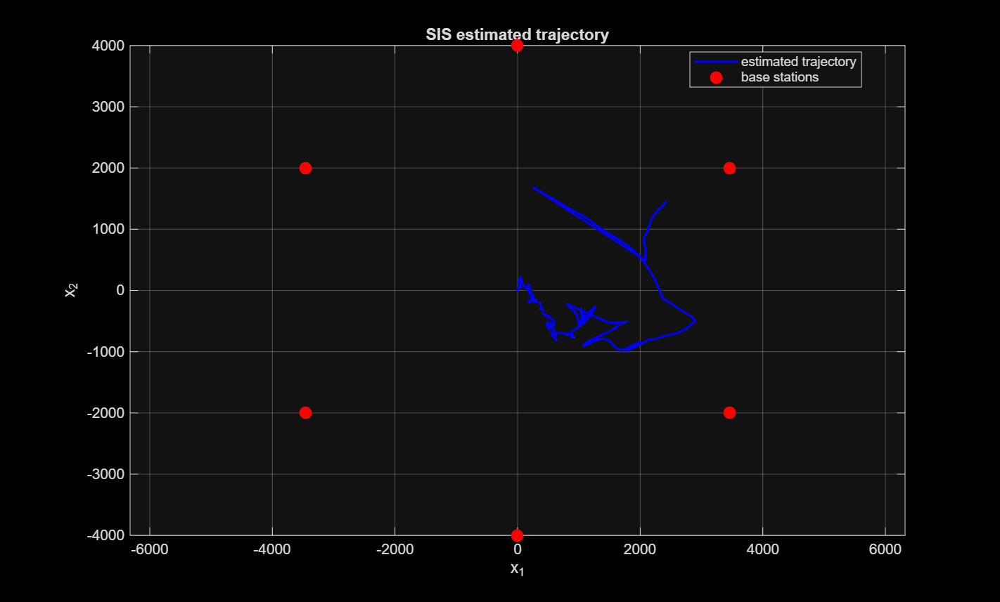
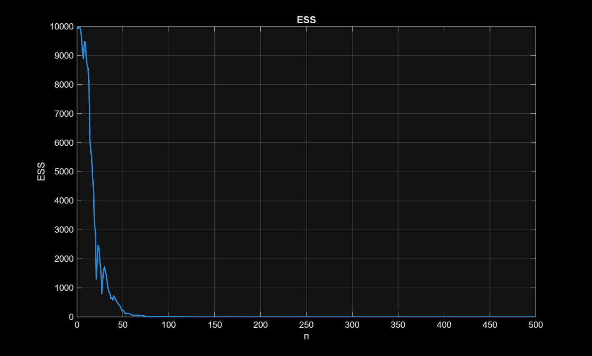
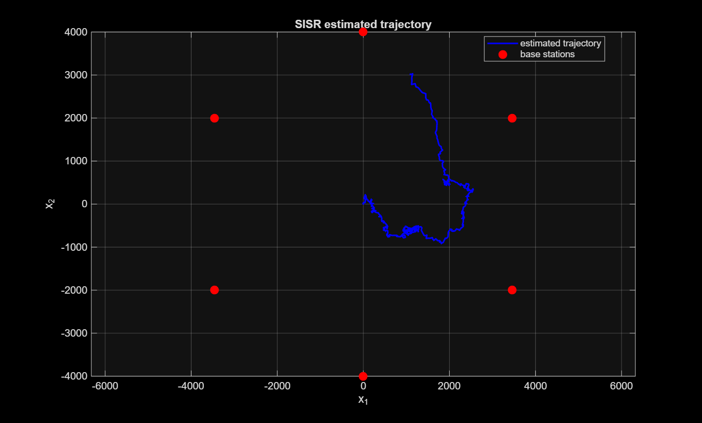
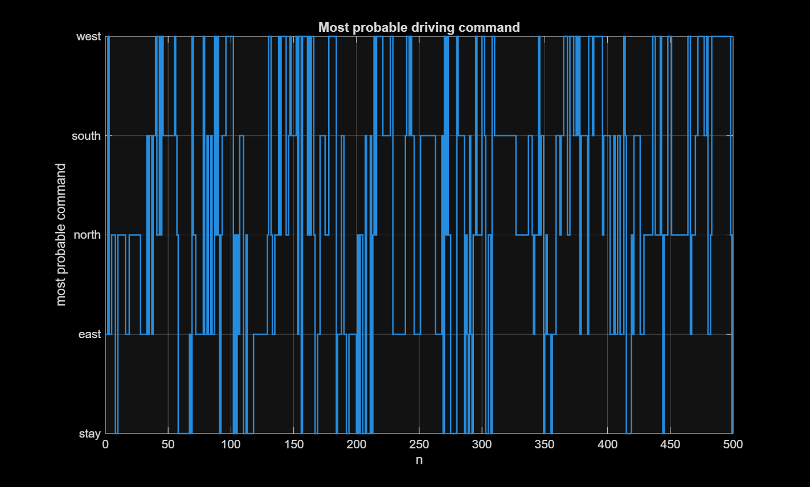
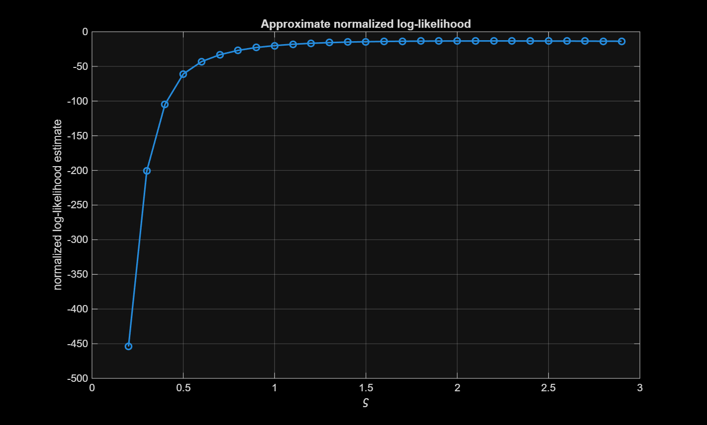
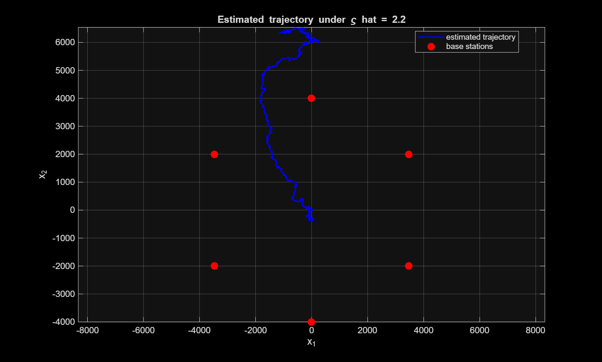

# Sequential Monte Carlo Mobility Tracking using RSSI Measurements

This project implements Sequential Monte Carlo methods for tracking a moving target from received signal strength indication (RSSI) measurements in a cellular network.

The target moves in two spatial dimensions according to a linear Gaussian motion model with a discrete Markovian driving command. The observations are nonlinear RSSI measurements from six fixed base stations. Because the observation model is nonlinear in the target position, standard linear Kalman filtering is not directly applicable. Instead, particle filtering methods are used to estimate the posterior position of the target over time.

## Project overview

The project covers:

- simulation of trajectories from the mobility model,
- formulation of the model as a hidden Markov model,
- target-position estimation using Sequential Importance Sampling (SIS),
- target-position estimation using Sequential Importance Sampling with Resampling (SISR),
- investigation of particle degeneracy through effective sample size,
- inference of the most likely driving command over time,
- approximate maximum likelihood estimation of the observation noise standard deviation.

## Model

The hidden state is

\[
X_n =
(X_n^1, \dot X_n^1, \ddot X_n^1,
 X_n^2, \dot X_n^2, \ddot X_n^2)^\top,
\]

where \(X_n^1\) and \(X_n^2\) are the target positions in the plane. The state evolves according to

\[
X_{n+1} = \Phi X_n + \Psi_z Z_n + \Psi_w W_{n+1},
\]

where \(Z_n\) is a discrete driving command and \(W_{n+1}\) is Gaussian process noise.

The driving command has five possible values:

1. stay,
2. east,
3. north,
4. south,
5. west.

The RSSI observation from base station \(\ell\) is modeled as

\[
Y_n^\ell =
v - 10\eta \log_{10}
\left\|
(X_n^1, X_n^2)^\top - \pi_\ell
\right\|
+ V_n^\ell,
\]

where \(\pi_\ell\) is the position of base station \(\ell\), \(v\) is the transmission power, \(\eta\) is the slope index, and \(V_n^\ell\) is Gaussian observation noise.

## Methods

### Sequential Importance Sampling

Sequential Importance Sampling propagates particles using the prior dynamics and updates the particle weights using the observation likelihood. The posterior expected target position is approximated by the weighted particle mean.

A limitation of SIS is particle degeneracy: after several time steps, most particles receive negligible weight.

### Sequential Importance Sampling with Resampling

To reduce particle degeneracy, systematic resampling is added after each weighting step. This duplicates particles with high posterior weight and removes particles with low weight. The resulting method is a standard particle filter.

### Driver command inference

The posterior probability of each driving command is estimated by summing the weights of particles assigned to that command. The most probable command at each time point is then obtained from the largest posterior command probability.

### Observation noise calibration

The observation noise standard deviation is estimated by evaluating an approximate particle-filter log-likelihood over a grid of candidate values. The value with the largest estimated normalized log-likelihood is selected as the approximate maximum likelihood estimate.

## Repository structure

```text
.
├── README.md
├── main_HA1.m
├── src/
│   ├── setup_model.m
│   ├── extract_measurements.m
│   ├── simulate_trajectory.m
│   ├── run_sis.m
│   ├── run_sisr.m
│   ├── estimate_varsigma_grid.m
│   ├── systematic_resampling.m
│   └── plot_results.m
├── data/
│   └── README.md
└── figures/
    ├── simulated_trajectory.png
    ├── sis_trajectory.png
    ├── sis_ess.png
    ├── sis_weights_n0.png
    ├── sis_weights_n25.png
    ├── sis_weights_n50.png
    ├── sisr_trajectory.png
    ├── command_mode.png
    ├── command_probabilities.png
    ├── loglikelihood_grid.png
    └── calibrated_trajectory.png

## Running the code

The project is written in MATLAB.

From the main project folder, run:

```matlab
main
```

The script:

- sets up the model,
- simulates a trajectory from the motion model,
- runs the SIS algorithm,
- runs the SISR algorithm,
- estimates the observation noise standard deviation,
- produces the figures used in the analysis.

## Data

The `.mat` files required to run the project are provided through the course page and are not included in this repository.

Expected local files:

```text
data/stations.mat
data/RSSI-measurements.mat
data/RSSI-measurements-unknown-sigma.mat
```

If the downloaded files have different names, either rename them or update the file paths in `main_HA1.m`.

## Example output

### Simulated trajectory



### SIS estimated trajectory



### Effective sample size for SIS



### SISR estimated trajectory



### Most probable driving command



### Approximate log-likelihood for observation noise calibration



### Estimated trajectory under calibrated observation noise



## Main files

### `main.m`

Main script that reproduces the full analysis.

### `setup_model.m`

Defines the motion model, transition matrix, driving-command values, initial distribution, and fixed model parameters.

### `simulate_trajectory.m`

Simulates an artificial trajectory from the state-space model.

### `run_sis.m`

Implements Sequential Importance Sampling for the RSSI tracking problem.

### `run_sisr.m`

Implements Sequential Importance Sampling with Resampling and estimates posterior command probabilities.

### `estimate_varsigma_grid.m`

Estimates the observation noise standard deviation by grid search using particle-filter likelihood estimates.

### `systematic_resampling.m`

Implements systematic resampling for the SISR algorithm.

## Notes on reproducibility

The algorithms are simulation-based, so numerical results can vary slightly between runs unless a random seed is fixed. To reproduce exactly the same particle trajectories and estimates, add the following command near the top of `main_HA1.m`:

```matlab
rng(1)
```


